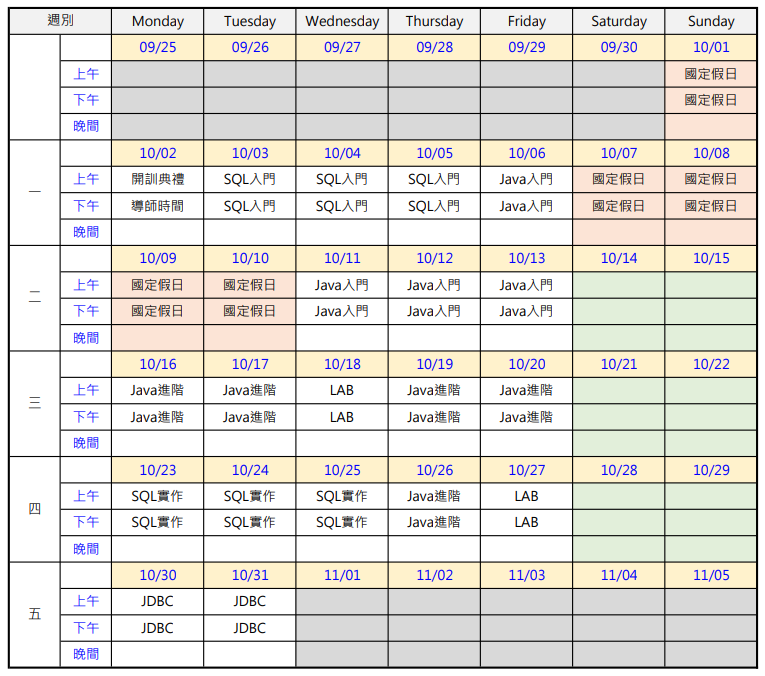
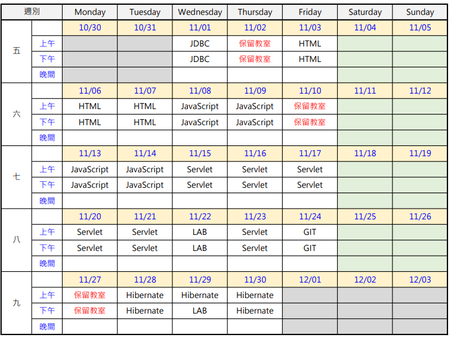
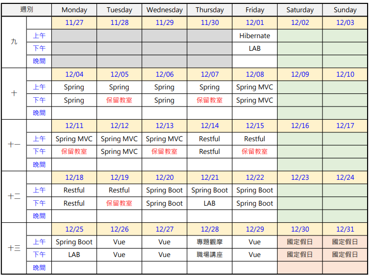
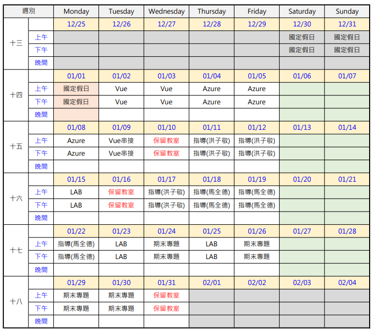
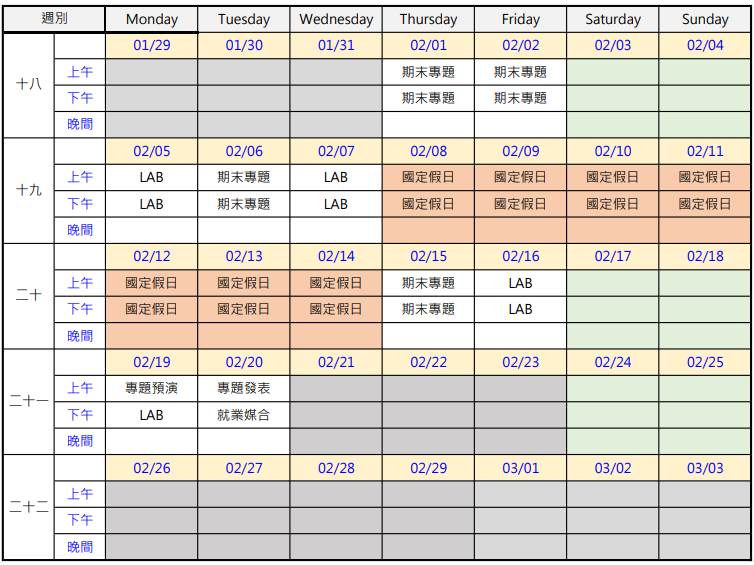

## Getting Started

Welcome to the VS Code Java world. Here is a guideline to help you get started to write Java code in Visual Studio Code.

## Folder Structure

The workspace contains two folders by default, where:

- `src`: the folder to maintain sources
- `lib`: the folder to maintain dependencies

Meanwhile, the compiled output files will be generated in the `bin` folder by default.

> If you want to customize the folder structure, open `.vscode/settings.json` and update the related settings there.

## Dependency Management

The `JAVA PROJECTS` view allows you to manage your dependencies. More details can be found [here](https://github.com/microsoft/vscode-java-dependency#manage-dependencies).

EEIT 課程須知

班級導師：馬全德 / 02-6631-6558 / cma@ispan.com.tw
教務承辦：邱美智 / 02-6631-6582 / chiu@ispan.com.tw
上課時間與簽到規範

A. 上午：9:0012:00、下午：13:3016:30
B. 儘量在上午 8:55 前以及下午 13:25 前進入教室。
C. 每堂課時間長短由任課老師控制，不固定在 1 個小時也不一定準時在 12:00 與 16:30 下課，同學可依據需要(例如上廁所)自行離開。
D. 每日需要 4 次簽到(上午簽到、中午簽退、下午簽到、下午簽退)，請使用櫃台的簽到單完成簽到程序，簽到單需要定期繳回勞動部請使用正楷填寫。
E. 每節課須準時到課，遲到早退者都需要請假否則以曠課論。上午上課遲到逾時 15 分鐘者(9:15 之後到達)，以缺課 1 小時計算，請填寫 1 個小時的請假單。
缺課規定

缺(曠)課達到班級總時數 10%視為自動退訓，必須辦理退訓手續並且無法繼續參與後續課程。本班的缺課時數限制是 51 小時或是 8.5 天。
結業證書取得規定

A. 參與全期課程，缺課時數不超過總時數的 1/10。
B. 完成課程作業並參與考試，成績達 60 分以上。
C. 完成期末專題並參與專題發表。
夜間自習教室使用規範

A. 原上課教室最晚可以停留時間是 18:00，如果教室當天有安排夜間課程則需要提前在 17:30 離開。
B. 如果有夜間自習需求可以使用大安大樓二樓 201、204、206 教室，夜間自習教室開放時間為 18:00~21:00。
個人物品與硬碟

A. 個人物品帶走不要留在教室。
B. 下課後請將硬碟放回教室前面的硬碟箱。
C. 課程資料隨時備份，硬碟損壞請跟櫃台反應，由櫃台更換一顆新硬碟給同學(無法還原舊硬碟的資料)。
值日生

每日由班上同學輪流擔任值日生，主要職責是
A. 填寫教室日誌
B. 早上上課之前(8:55)統計需要代訂便當服務的同學，收錢並記錄姓名之後交給櫃檯。
專題分組

A. 各位同學在 11/03 之前自行尋找組員建立期末專題團隊，並將組長及組員名單交給導師，每組成員原則為 6 人(需要超限制請先徵求導師同意)。
B. 各組自行決定期末專題題目，並在完成資料庫設計後找導師討論，討論時間統一訂在中午吃飯休息時間，並事先與導師約定。
C. 期末專題討論期限請不要超過 12 月底。